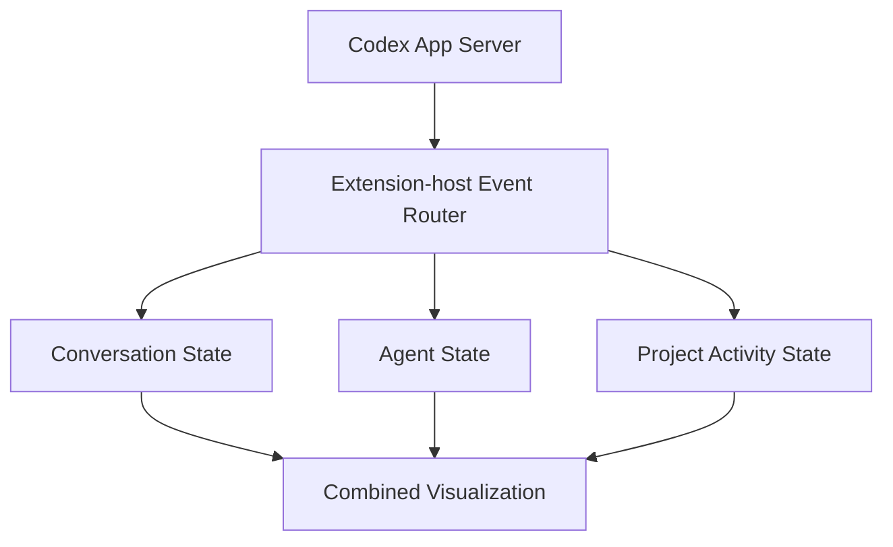

# Codex Agent Map

Codex Agent Map is a VS Code extension that combines a complete root-agent Codex conversation client with a live agent hierarchy and a stable, user-confirmed project architecture map.

## Stage 1 conversation features

- Owns one `codex app-server` process for the extension-host lifetime.
- Detects and verifies the configured Codex executable.
- Uses the App Server initialization handshake over newline-delimited JSON on stdin/stdout.
- Reuses existing Codex/ChatGPT authentication and can start browser sign-in when needed.
- Discovers models, supported reasoning efforts, and collaboration modes dynamically.
- Creates, lists, previews, resumes, and restores workspace threads, with a collapsible and resizable thread sidebar. Empty local threads are discarded unless their first prompt is sent.
- Displays complete stored history without resuming a thread.
- Streams agent messages, plans, commands, file changes, diffs, tools, warnings, and errors.
- Sends guidance to an active turn with `turn/steer` and stops with `turn/interrupt`.
- Handles command, file-change, permission, and tool-input requests without automatic approval.
- Persists lightweight UI preferences while leaving conversation persistence to Codex.

This extension is its own Codex client. It does not modify or depend on private APIs from OpenAI's official Codex extension, and it does not live-sync with a currently active turn in that extension.

## Stage 2 visual workspace

Stage 2 adds Combined, Agents, Project, and Chat views without replacing Stage 1. Combined keeps the execution map and main-agent conversation together; the focused views dedicate the editor to the hierarchy, architecture, or complete Stage 1 chat.

The selected root thread remains visible as **Main Agent** while idle. Successful turns return it to Idle. Runtime subagents appear under their immediate parent with task, role, status, activity, duration, files, tools, and errors. They are inspection-only: users communicate only with the main agent, and subagents never receive a composer.

Project components stay fixed during live work. Architecture edges are persistent and calm; agent-to-project edges are dynamic. Confirmed edges use direct file/tool/host evidence. Inferred edges use command CWDs, paths, test detection, or configured command patterns and are visibly dashed. Completed work becomes a recent trail and expires according to settings.



## Requirements

- VS Code 1.96 or newer
- Node.js 20 or newer for development
- A working Codex CLI/App Server executable
- A ChatGPT account supported by Codex

Install Codex CLI if it is not already available, then verify it:

```text
codex --version
```

By default, the extension first tries `codex` on the Extension Host's `PATH`. If that is unavailable, it automatically searches the official OpenAI extension folders for the bundled platform-specific Codex executable. Set `codexAgentMap.codexPath` to an explicit executable when more than one installation exists or exact version selection matters.

## Development

```text
npm install
npm run typecheck
npm run lint
npm test
npm run build
```

Open this repository in VS Code and press F5. The included launch configuration builds the extension and opens an Extension Development Host. In that host, run **Codex Agent Map: Open Workspace** from the Command Palette.

### Initialize a project map

Run **Codex Agent Map: Initialize Project Map** or open Project view. Choose **Scan Project** for bounded deterministic suggestions or **Create Manually**. The scanner reads common manifests and directory names locally; it never sends scan data to a model or automatically writes suggestions. Review, accept/reject, rename, change types and paths, add components and architecture edges, then choose **Confirm and Save**.

Maps use schema version 1 and default to `.codex-agent-map/project-map.json`. A JSON Schema is available at `schemas/project-map.schema.json`. Invalid external edits retain the last valid in-memory map and report validation errors.

```json
{
  "schemaVersion": 1,
  "project": { "name": "Example" },
  "components": [
    { "id": "app", "name": "App", "type": "frontend", "paths": ["src/**"], "position": { "x": 100, "y": 100 } }
  ],
  "edges": []
}
```

Supported types include frontend, backend, service, MCP, database, cache, queue, storage, external, tests, shared, infrastructure, and other. Components may also define command, tool, app, and domain matchers.

### Run a multi-agent visualization

Select or start a root thread and ask the main agent to delegate bounded tasks. For example: “Inspect this repository using three read-only subagents for frontend, backend, and tests; wait for all and summarize.” Collaboration events create children immediately; paginated descendant reconciliation recovers missed metadata. If the experimental filter is unsupported, the root visualization and live collaboration events continue with an honest recovery warning.

### Demo Mode

Run **Codex Agent Map: Run Visualization Demo** or select **Run Demo**. Demo Mode does not call Codex or consume usage. It exercises the production reducers with agents, architecture, confirmed and inferred connections, approvals, completion, and failure. **Stop Demo** restores untouched live visualization state.

### Commands

- Open Visual Workspace
- Initialize Project Map
- Scan Project Architecture
- Edit Project Map
- Save Project Layout and Auto Layout Project
- Reset Agent Layout and Fit Visualization
- Run/Stop Visualization Demo
- Show Unmapped Activity

### Stage 2 settings

- `codexAgentMap.descendantPollIntervalMs` — active reconciliation interval, default 1500 ms.
- `codexAgentMap.activityTrailDurationSeconds` — recent-trail lifetime, default 120 seconds; zero disables trails.
- `codexAgentMap.showInferredActivityEdges` — show labelled inferred activity.
- `codexAgentMap.maxRecentComponentConnectionsPerAgent` — bounded recent connections, default 5.
- `codexAgentMap.completedAgentDisplay` — `show`, `collapse`, or `activeOnly`.
- `codexAgentMap.autoFitOnNewAgent` — fit when a new agent appears.
- `codexAgentMap.projectMapPath` — validated workspace-relative map path.

## Using the client

### Connect and sign in

Opening the workspace starts one App Server process in the selected workspace directory. The header shows connection and account state. If authentication is required, select **Sign in with ChatGPT** and finish the flow in the browser. Tokens and credentials are never shown or persisted by the extension.

### Start or resume a thread

Select **New thread**, type a prompt, and select **Send**. Recent threads are grouped by workspace, with the current VS Code workspace first and the newest threads first inside each group. Selecting a stored thread previews its complete history without taking control; use **Resume thread** at the end of the conversation before sending a follow-up.

A warning appears before resuming a thread whose runtime status is active:

> This thread may be active in another Codex client. Controlling one thread from multiple clients at the same time can cause confusing behavior.

One thread should be actively controlled by one client at a time.

### Model, reasoning, and Plan mode

The composer selectors come from App Server rather than hardcoded model names. Changing the model updates its reasoning-effort options. Plan mode is enabled only when `collaborationMode/list` exposes it. Selectors are locked during an active turn and apply to the next turn.

### Steer and interrupt

While Codex is working, the composer becomes an additional-guidance input and uses `turn/steer`; it does not create an overlapping turn. **Stop** sends `turn/interrupt`. The UI remains in **Stopping…** until App Server reports the authoritative final turn status.

### Approvals and input

Approval cards show the associated command, file change, permissions, or tool question. Only server-supported decisions are sent, using the original server request ID. Privileged actions are never automatically approved. Permission grants cannot exceed what the server requested.

## Privacy and persistence

Codex is the authoritative conversation store. The extension persists only lightweight workspace/UI state and user-confirmed architecture data. Runtime activity is not written into the project map.

It does not persist full prompts, agent responses, raw command output, diffs, tokens, credentials, environment-variable values, approval payloads, complete sensitive URLs, or hidden reasoning. Raw hidden reasoning is never displayed; only server-provided summaries may be shown. Architecture scanning remains local and is never sent to another service.

## Security

- The Webview has a restrictive Content Security Policy and locally bundled scripts/styles.
- Markdown is sanitized before rendering.
- All Webview messages use validated discriminated unions.
- Model, effort, mode, thread, turn, approval, and path inputs are checked in the extension host.
- File-opening actions are restricted to paths inside the active workspace.
- The Webview has no direct process or filesystem access.

## Troubleshooting

### Codex executable not found

The extension automatically falls back to the Codex executable bundled with an installed official OpenAI VS Code extension. If neither `PATH` nor that fallback works, run **Codex Agent Map: Choose Codex Executable**, select the desired binary, and reconnect. Check **Codex Agent Map** in the Output panel for sanitized details.

### Connected but signed out

Use **Sign in with ChatGPT**. If another Codex interface is already authenticated, App Server normally reuses that account.

### Plan mode is unavailable

Plan mode is disabled when the installed App Server does not expose `collaborationMode/list`. Upgrade Codex and reconnect.

### A stream disconnected

The visible conversation remains as stale state. Use **Reconnect**; the extension will not automatically restart a turn.

### Multiple Codex versions on Windows

PowerShell can resolve an npm `codex.ps1` while Node resolves a later `codex.exe` on `PATH`. Set `codexAgentMap.codexPath` explicitly when exact version selection matters.

## Known limitations

- Architecture detection is heuristic and always requires confirmation.
- Runtime subagents are inspection-only; direct messaging and conversation forking are not implemented.
- Custom-agent definitions, `.codex/agents/*.toml`, skills, and `AGENTS.md` visualization are deliberately outside Stage 2.
- Image and generic file attachments, mentions, and a skill picker are not implemented.
- Conversation forking and non-Codex providers are not implemented.
- Command output and diffs are bounded previews, not a terminal emulator or full diff editor.
- The client cannot take over or live-synchronize a turn currently controlled by another client.
- Collaboration modes depend on the installed App Server's experimental API.

## Roadmap

Stage 3 will add custom-agent definition visualization and controlled delegation. Stage 4 may add richer instruction, skill, and execution-context views. Hidden reasoning will remain excluded.

## Protocol references

Versioned TypeScript protocol references live under `.protocol-reference/`. They were generated with:

```text
codex app-server generate-ts --experimental --out <versioned-directory>
```

The repository records the initial npm CLI reference (`0.144.5`) and the exact VS Code-bundled runtime reference used during final smoke testing (`0.145.0-alpha.18`).
